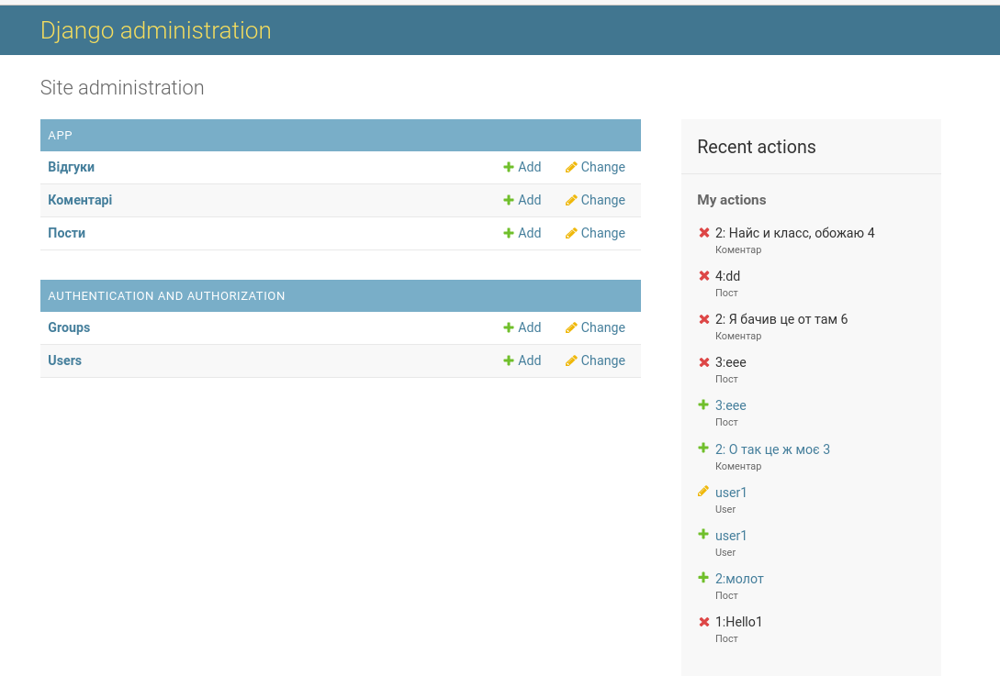
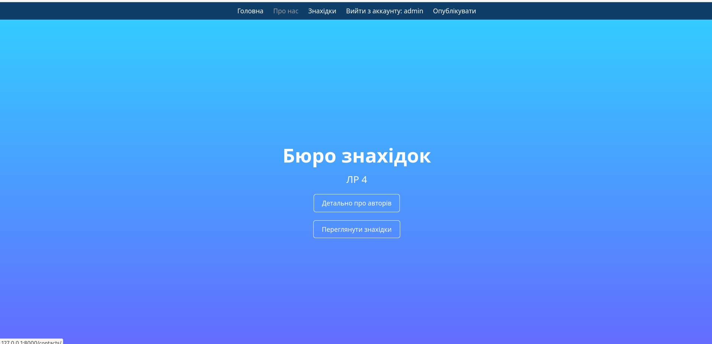
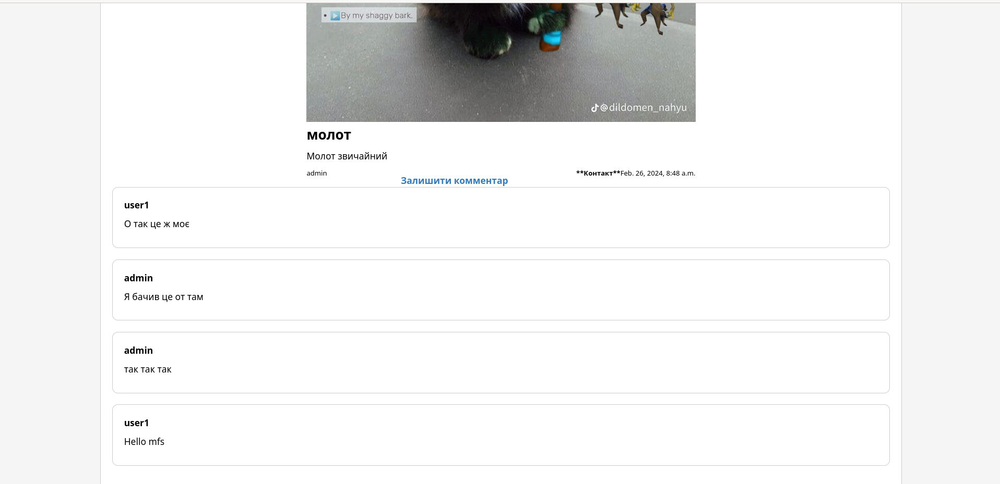
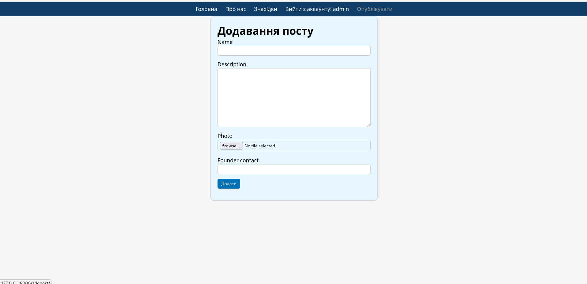

## Short Description

Бюро знахідок

## Функції

* Учбовий проект на Django + sqlite3 + HTML/CSS для предмету "Web-технології на Python"
* Наявна авторизація, робота с постами (коментарі до постів крім їх прегляду)
* Наявна адмін панель для адміністратора сервісу

## Скріншоти






## Запуск

```bash

pip install -r requirements.txt
python manage.py runserver
